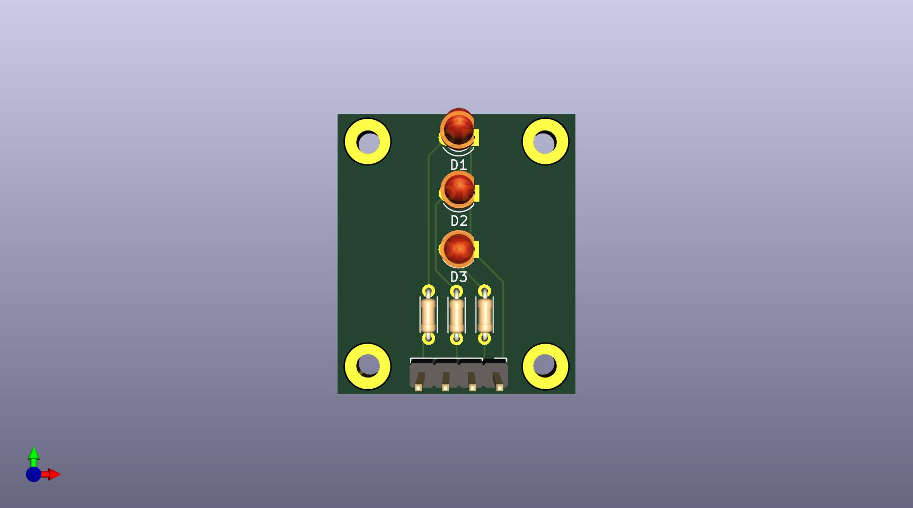
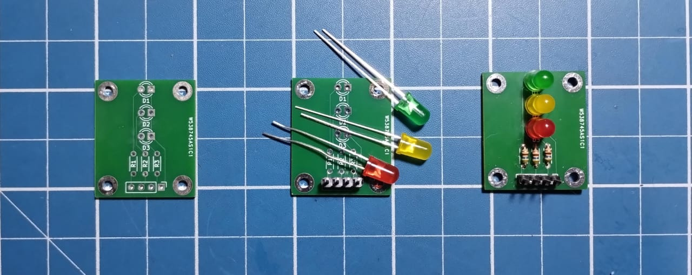

# Mini Traffic Light PCB

## Introduction

This repository contains the design files for a mini traffic light PCB created using KiCad. The PCB features three vertically arranged LEDs that simulate a standard traffic light. The design also includes the necessary resistors and a connector for easy integration into other projects.

## Schematic Overview

The schematic is designed as follows:

- Each LED (D1, D2, D3) is connected in series with a resistor (R1, R2, R3).
- The anode of each LED is connected to the positive voltage rail through the corresponding resistor.
- The cathode of each LED is connected to the ground.
- The 4-pin connector at the bottom provides external connections, with each pin corresponding to an LED and a common ground.

